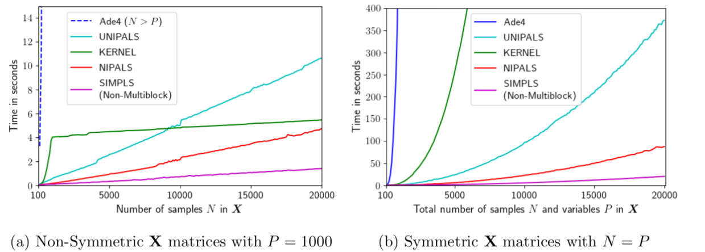

# Introduction
Partial Least Squares (PLS) regression is a statistical method for supervised multivariate analysis.
It relates two data blocks $\textbf{X}$ and $\textbf{Y}$ to each other with the aim of establishing a prediction model.
When deployed in production, this model can be used to predict an outcome $\textbf{y}$ from a newly measured feature
vector $\textbf{x}$. PLS is popular in chemometrics, process control and other analytic fields, due to its striking
advantages, namely the ability to analyze small sample sizes and the ability to handle high-dimensional data with
cross-correlated features (where Ordinary Least Squares regression typically fails). In addition, and in contrast to 
many other machine learning approaches, PLS models can be interpreted using its latent variable structure just like
principal components can be interpreted for a PCA analysis.

Multivariate data is often structured in blocks, e.g. $\textbf{X}_1$, $\textbf{X}_2$, ... , $\textbf{X}_i$.
This could mean that one has obtained data from two different analytic methodologies for a similar set of samples,
which may indicate two totally independent feature spaces. In such cases it is often important to understand how each
data block contributes to the prediction of $\textbf{Y}$. Several Data Fusion approaches were proposed to establish
combined prediction models from such multiblock data [@li:16]. One of the proposed methods is
Multiblock-PLS (MB-PLS) [@westerhuis:98]. It is closely related to PLS regression, but instead of obtaining an 
interpretative model for the entire (concatenated) data matrix $\textbf{X}$ one obtains model parameters for each 
individual data block $\textbf{X}_i$. Furthermore, it provides a relative importance measure, i.e. expressing how much
each block $\textbf{X}_i$ contributes to the prediction of $\textbf{Y}$. Subsequently, this information can be used to
recognize block specific patterns in the data.

At the current stage software packages for MB-PLS exist for Matlab
([http://www.models.life.ku.dk/MBToolbox](http://www.models.life.ku.dk/MBToolbox))
and R [@bougeard:18]. In the following sections we give a brief introduction to the statistical method and its
implementation. The package is distributed under the BSD-3-Clause license and made available
at
[https://github.com/DTUComputeStatisticsAndDataAnalysis/MBPLS](https://github.com/DTUComputeStatisticsAndDataAnalysis/MBPLS)
together with several introductory Jupyter
notebook examples. It is also available as \texttt{pip} installable Python package
([https://pypi.org/project/mbpls/](https://pypi.org/project/mbpls/)) and comes with a
Read-the-Docs documentation ([https://mbpls.readthedocs.io](https://mbpls.readthedocs.io)).

# Methods
The MB-PLS package can be utilized for PLS and MB-PLS regression. The statistical background is briefly introduced in
the following. More detailed information is given in the \texttt{mbpls} help of the Python package
([https://mbpls.readthedocs.io/en/latest/mbpls.html](https://mbpls.readthedocs.io/en/latest/mbpls.html)).

## PLS
PLS was introduced by @wold:84 and aims at finding a suitable subspace projection $\textbf{w}$ which maximizes
co-variance between a so called score vector $\textbf{t}$ and a response vector $\textbf{y}$ that will yield a least
squares solution. The formal PLS criterion for univariate responses $\textbf{y}$ is given in eq. \ref{eq1}. 
$$
    \underset{\textbf{\textbf{w}}}{\mathrm{arg max}}\; \left(cov(\textbf{t}, \textbf{y}) \: 
    \middle |  \: min\left(\sum_{i=1}^{I} \sum_{j=1}^{J}(\textbf{x}_{ij} - 
    \textbf{t}_{i}\textbf{w}_{j})^2\right)
    \land \Vert \textbf{w} \Vert = 1 \right ) \tag{1} \label{eq1}
$$

This procedure is typically repeated to find $K$ latent variables (LV). In each latent variable step, the score vector
$\textbf{t}_k$ is subsequently projected onto its respective matrix $\textbf{X}_k$ to find the loading vector
$\textbf{p}_k$ (eq. \ref{eq2}). Once found, $\textbf{X}_{k}$ is deflated by the explained variance (eq. \ref{eq3})
and the next latent variable $k+1$ can be calculated using $\textbf{X}_{k+1}$.   

$$
    \textbf{p}_{k} = \textbf{X}_k\textbf{t}_{k} \tag{2} \label{eq2}
$$
$$
    \textbf{X}_{k+1} = \textbf{X}_{k} - \textbf{t}_{k} \textbf{p}_{k^T} \tag{3} \label{eq3}
$$

Algorithms to perform PLS regression include the \textbf{N}onlinear \textbf{I}terative \textbf{PA}rtial \textbf{L}east
\textbf{S}quares (NIPALS) [@wold:84], \textbf{UNI}versal \textbf{PA}rtial \textbf{L}east \textbf{S}quares
(UNIPALS) [@dunn:89], Kernel UNIPALS [@lindgren:93; @rannar:94; @rannar:95] and SIMPLS algorithm [@jong:93].
While NIPALS represents an iterative approach, the other algorithms are based on Singular Value Decomposition (SVD).
All the above mentioned algorithms are implemented in the MB-PLS package. Benchmark results and comparisons to other
Software packages are provided below. 

## MB-PLS
{ width=300px }

MB-PLS can be understood as an extension of PLS to incorporate several data blocks $\textbf{X}_1, ... \: ,
\textbf{X}_i$, which all share a common sample dimension. The prediction accuracy does not deviate from normal PLS,
if all data blocks were concatenated into a single block, but the advantage of MB-PLS is to gain extra model
interpretability concerning the underlying block structure of the data. For each LV one obtains extra block scores,
block loadings and block importances (BIP). The extraction of a single LV using MB-PLS is illustrated in
figure \ref{fig:mbpls}. The results are read in a fashion that 67\% variance in $\textbf{Y}$ are explained by the first
LV. The two blocks $\textbf{X}_1$ and $\textbf{X}_2$ contribute to the prediction of the 67\% with their relative BIPs,
43\% and 57\%, respectively. More important blocks result in more influential block loadings and contribute stronger to
the prediction of $\textbf{Y}$. Hence, interpretation of patterns among block scores with high importance are
recommended.

To assert that the BIP is a meaningful indicator it is necessary to standardize the data prior to MB-PLS analysis.
When standardization is employed all features in all blocks have a variance of $1$. For post-hoc interpretation of the
loadings an inverse transformation is carried out to ensure straight forward interpretation of the results.

# Software and Implementation
The package is written in pure Python 3. In its core it builds on Numpy and Scipy for efficient data handling and fast
mathematical operations of big data-sets. To achieve a fast implementation all algorithms using SVD employ Scipy's
partial SVD capability, i.e. by only calculating the first singular value at each PLS iteration. Multiple matrix
multiplications use the optimized Numpy multi-array multiplication. In addition, the MB-PLS implementation can handle
missing data without prior imputation based on the sparse NIPALS algorithm by @martens:01.
The overall code design follows the structure and philosophy of Scikit-learn [@pedregosa:11]. Therefore, objects
are instantiated in a Scikit-learn manner and can be accessed with the same methods, i.e. fit, predict, transform and
score. Furthermore, Scikit-learn's base classes and validation methods are incorporated. As a result, all objects are
fully compatible to Scikit-learn and, thus, allow the use of model selection functions, e.g. cross validation and grid
search, as well as a processing pipeline.
For exploratory analysis, each fitted model contains a custom $\texttt{plot}$ method that the fitted model attributes
in a meaningful manner using Matplotlib, which allows a straight forward evaluation of the MBPLS results without
requiring any additional coding.

# Benchmark
{width=470px}

To compare the four algorithms, the run-times are analyzed for different data-set sizes with two basic shapes, i.e.
non-symmetric shapes with more samples than variables ($N>P$) or vice versa ($N<P$) and symmetric shapes ($N=P$). To
simulate the multiblock and multivariate behaviour, each data-set is split into two $\textbf{X}$-blocks with the size
$N\times\frac{P}{2}$ and accompanied by a $\textbf{Y}$-block of size $N\times10$. The data is randomly generated for
each run, so that the obtained times exhibit worst-case behaviour, since there are no actual latent structures. All
algorithms are set to find the first 20 LVs and are run three times for each data-set size on a machine with two
Intel &reg; Xeon &reg; X5650 @ $2.67~GHz$ processors and $48~GB$ RAM.

As to be seen in both both plots of figure \ref{fig:runtimes} all algorithms implemented in the Python mbpls package
substantially outperform the above mentioned R-package Ade4-MBPLS by @bougeard:18, which was run on the same
machine. In general NIPALS is the fastest multiblock algorithm that is only outperformed by the SIMPLS algorithm,
which only supports single block PLS. However, figure \ref{fig:runtimes}a shows how the KERNEL algorithm performs
progressively better in cases where $N>>P$ or $N<<P$. As to be seen in this plot, the runtime of this algorithm is a
combination of an exponential part given by the right plot and dependent on $min(N,P)$ and a linear part defined by
$diff(N,P)$. Due to the exponential part, $min(N,P)$ has to be considered carefully when choosing the KERNEL algorithm
over NIPALS.

An important feature of this Python mbpls package is its invariance to shape rotations, i.e. it obtains the same
run-times for both $N>P$ and $N<P$ given the same ratio $\frac{N}{P}$ and its respective inverse, which e.g. is not
the case for the R-package.

# Acknowledgement
The authors gratefully acknowledge the financial support through the BioPro (Innovationsfonden project nr. 10513) and
DABAI (Innovationsfonden project nr. 10599 and 10577) project.

# References